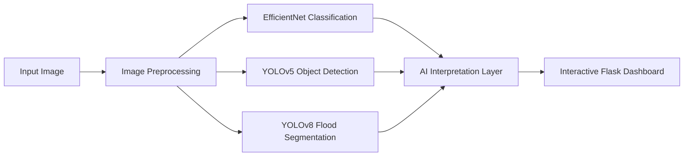

<p align="center">
  
</p>

<h1 align="center">
Emergency Smart Flood Alerting System for Safer Driving in Saudi Arabia
</h1>

<p align="center">
AI-Based Computer Vision System for Flood Detection, Environmental Monitoring, and Road Safety
</p>

---

<p align="center">


</p>

---

# 🌊 Project Overview

Flooding represents a major environmental risk that significantly impacts road safety and transportation infrastructure.

This project introduces an **AI-powered flood monitoring system** that analyzes road environments using **advanced computer vision models**.

The system combines multiple deep learning approaches to automatically:

• Detect flood conditions in road scenes  
• Identify affected objects such as vehicles and humans  
• Segment flooded regions and estimate water levels  

The results are presented through an **interactive AI dashboard**, enabling intuitive visualization of environmental conditions.

This work demonstrates how **artificial intelligence can enhance disaster awareness and improve road safety through visual environmental analysis.**

---

# 🚀 Key Strengths of the System

This project demonstrates several strong technical contributions:

✔ Integration of **multiple computer vision tasks within one unified AI pipeline**

✔ Combination of **classification, object detection, and segmentation models**

✔ Implementation of **state-of-the-art deep learning architectures**

✔ Development of a **fully functional AI-powered web interface**

✔ Evaluation across **multiple datasets for robust environmental analysis**

✔ High-performance results demonstrating the effectiveness of modern deep learning approaches

---

# 🧠 AI System Pipeline

The system uses a multi-stage computer vision architecture.



---

# 🤖 AI Models

The system integrates several powerful deep learning models.

| Task | Model | Role |
|-----|------|------|
| Scene Classification | EfficientNet | Detect flood vs non-flood environments |
| Object Detection | YOLOv5 | Detect flooded vehicles and humans |
| Flood Segmentation | YOLOv8 | Identify flooded regions in the scene |

Pre-trained models included in the repository:

```
EfficientNet_Without_Dropout.pth
YoloV5_best.pt
YoloV8_best.pt
```

These models provide high-performance visual analysis across multiple flood-related tasks.

---

# 📊 Datasets

The system was trained using multiple publicly available datasets covering diverse flood scenarios.

### Flood / No-Flood Dataset
Binary classification dataset containing flood and non-flood road scenes.

### Flood Dataset (4GB)
Large dataset containing thousands of flood and normal environment images.

### Flood Area Segmentation Dataset
Pixel-level annotated dataset for identifying flooded regions.

### Flooded Objects Dataset
Detection dataset including:

• flooded vehicles  
• flooded humans  

### Water Levels Dataset

Dataset containing **13 classes** representing different water levels for environmental severity estimation.

The use of multiple datasets enables the system to learn **diverse flood scenarios and environmental conditions.**

---

# 🔬 Experimental Setup

Experiments were conducted using:

```
Python 3.9
PyTorch 1.12
Google Colab GPU (NVIDIA T4)
```

Training configuration:

```
Optimizer: Adam
Learning Rate: 0.001

Batch Size
Classification: 32
Detection: 16
Segmentation: 4
```

Evaluation metrics include:

```
Accuracy
Precision
Recall
F1 Score
mAP@0.5
Intersection over Union (IoU)
```

---

# 📈 Experimental Results

The experimental evaluation demonstrates strong performance across all computer vision tasks.

### Classification Performance

EfficientNet achieved outstanding performance with a cross-validation accuracy of approximately:

```
98.48%
```

This highlights the effectiveness of deep learning models for flood scene classification.

---

### Detection Performance

YOLO-based models demonstrated strong object detection performance.

| Model | Precision | Recall | mAP@0.5 |
|------|------|------|------|
YOLOv5 | 0.73 | 0.77 | 0.76
YOLOv8 | **0.88** | **0.84** | **0.92**

---

### Segmentation Performance

YOLOv8 segmentation models achieved excellent performance in identifying flooded regions with high IoU and pixel accuracy.

These results demonstrate the effectiveness of deep learning models in **visual environmental analysis for flood monitoring systems.**

---

# 🖥 System Interface

The project includes a complete **AI-based web dashboard** developed using Flask.

Users can:

• Upload flood scene images  
• Select AI analysis models  
• Run automated image analysis  
• Visualize detection results  
• View flood segmentation overlays  

The interface provides a clear and intuitive way to interact with the AI system.

---

# 📂 Repository Structure

```
Emergency-Smart-Flood-Alerting-System

smart-flooding-system
│
├── app.py
├── templates
│   └── index.html
├── static
│
Program
│
├── CPCS432_Program.ipynb

models
│
├── EfficientNet_Without_Dropout.pth
├── YoloV5_best.pt
└── YoloV8_best.pt

docs
│
├── Research Paper
├── Technical Report
└── Dataset Sources
```

---

# ⚙ Installation

Clone the repository

```
git clone https://github.com/your-repo/flood-ai-system
cd flood-ai-system
```

Install dependencies

```
pip install -r requirements.txt
```

Run the system

```
python app.py
```

The Flask server will launch locally and allow interaction with the AI flood detection system.

---

# 🎥 Demonstration

A full system demonstration video is available in the **GitHub Releases section**.

---

# 📚 Citation

If you use this project for research or academic work, please cite:

```
Emergency Smart Flood Alerting System for Safer Driving in Saudi Arabia
King Abdulaziz University
Computer Vision for Disaster Monitoring
```

---

<p align="center">
AI for Disaster Awareness and Road Safety
</p>
