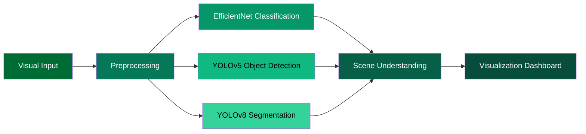
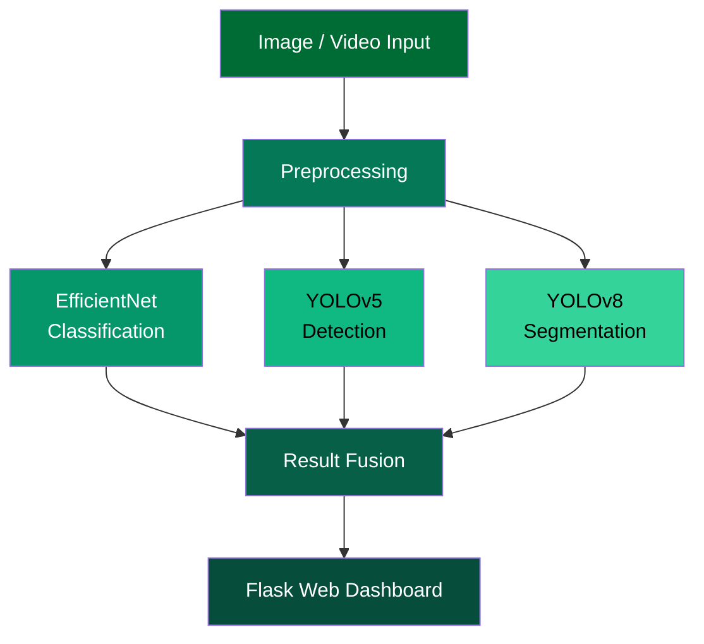
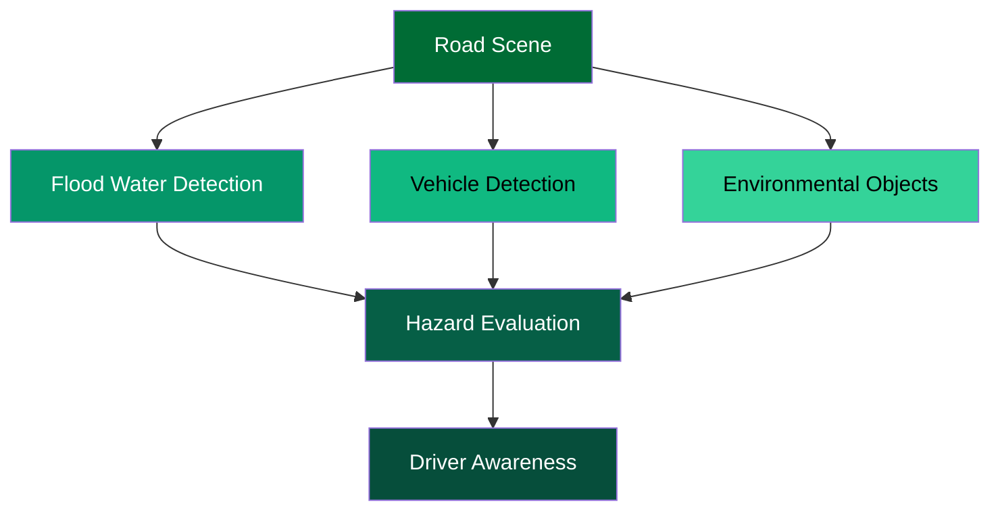

<p align="center">

</p>

<h1 align="center">
Emergency Smart Flood Alerting System for Safer Driving in Saudi Arabia
</h1>

<p align="center">
AI-Powered Computer Vision System for Flood Scene Analysis
</p>

<p align="center">


</p>

---


# 🌊 Project Overview

Flooding represents a major environmental hazard that can threaten drivers and transportation systems.  

This project introduces an **Artificial Intelligence system for flood scene analysis** using computer vision techniques.

The system integrates **deep learning models** with a **Flask-based web dashboard** to analyze flood imagery and visualize results.

The objective of this project is to demonstrate how **computer vision pipelines** can be used to analyze flood environments and present results through an interactive interface.

---

# 🧠 AI Vision Pipeline



The AI pipeline combines **classification, detection, and segmentation models** to analyze flood scenes from multiple perspectives.

---

# 🧩 3D System Architecture



The architecture demonstrates how multiple computer vision components collaborate within a unified pipeline.

---

# 📊 AI Model Overview

| Model | Purpose |
|------|------|
| EfficientNet | Flood scene classification |
| YOLOv5 | Object detection |
| YOLOv8 | Image segmentation |

The combination of these models enables **multi-level scene interpretation**.

---

# 📊 System Components

| Component | Description |
|------|------|
| AI Models | Deep learning models for visual analysis |
| Processing Pipeline | Image preprocessing and model inference |
| Web Dashboard | Interactive visualization interface |
| Documentation | Project methodology and datasets |

---

# 🧠 Flood Scene Analysis Concept



This conceptual diagram illustrates how computer vision techniques can interpret flood environments.

---

# 🖥 Web Application

The project includes a **Flask-based web interface** that allows users to interact with the system.

The interface demonstrates:

• visual input analysis  
• AI model inference  
• result visualization  

The application illustrates how **deep learning models can be integrated into interactive systems**.

---

# 🗂 Repository Structure

```
Emergency-Smart-Flood-Alerting-System
│
├── smart-flooding-system
│   ├── app.py
│   ├── requirements.txt
│   ├── templates
│   ├── static
│   └── models
│
├── Program
│   ├── CPCS432_Program.ipynb
│   └── Models
│
├── docs
│   ├── DatasetsLinks.txt
│   ├── Emergency_Smart_Flood_Alerting_System.pdf
│   └── Emergency Smart Flood Alerting System Report
│
└── assets
    └── project demonstration video
```

---

# ⚙ Installation

Clone repository:

```
git clone https://github.com/yourusername/Emergency-Smart-Flood-Alerting-System
cd Emergency-Smart-Flood-Alerting-System
```

Install dependencies:

```
pip install -r smart-flooding-system/requirements.txt
```

Run application:

```
python smart-flooding-system/app.py
```

---

# 📦 Model Weights

Model weights are provided through **GitHub Releases** to keep the repository lightweight.

After downloading the weights place them in:

```
smart-flooding-system/models
```

---

# 📚 Documentation

Project documentation is located in the **docs** directory.

The documentation describes the project methodology and implementation details.

---


<p align="center">

Artificial Intelligence for Environmental Scene Analysis

</p>
