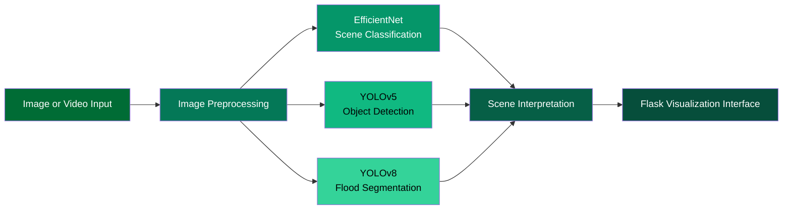

<p align="center">
  
</p>

<p align="center">
  
</p>

<p align="center">


</p>

<p align="center">
<b>Artificial Intelligence System for Flood Scene Analysis Using Computer Vision</b>
</p>

<p align="center">
<sub>Code and documentation are provided in this repository. Model weights and the system demonstration video are available through GitHub Releases.</sub>
</p>

<p align="center">

</p>

# 🔎 Table of Contents

- Research Overview  
- Research Motivation  
- Research Contribution  
- AI System Pipeline  
- System Implementation  
- Demonstration Video  
- Repository Structure  
- Installation and Execution  
- Documentation  

<p align="center">

</p>

# 🌊 Research Overview

Flooding is one of the most significant environmental hazards affecting road safety and transportation infrastructure.  
Flooded roads can lead to traffic accidents, infrastructure damage, and severe risks for drivers.

This project presents an **Artificial Intelligence system for flood scene analysis** using **computer vision techniques**.

The system analyzes visual road scenes and identifies environmental conditions related to flooding.  
The results are presented through a **Flask-based web visualization interface** that allows users to interpret AI predictions.

This work demonstrates how **deep learning models can analyze complex environmental scenes and support hazard awareness in transportation environments.**

<p align="center">

</p>

# 🎯 Research Motivation

Road flooding events present significant safety challenges for drivers and emergency response systems.

Traditional monitoring approaches rely on manual observation or sensor-based infrastructure, which may not always provide sufficient environmental awareness.

Computer vision provides an alternative approach by enabling automated **visual scene interpretation** using deep learning models.

The objective of this project is to explore how **AI-based visual analysis can interpret flood environments and present interpretable insights through a software interface.**

<p align="center">

</p>

# 🎓 Research Contribution

This project demonstrates a practical framework for **AI-based environmental scene interpretation** using computer vision.

The main contributions include:

• Integration of **multiple deep learning models** within a unified computer vision pipeline  
• Application of **classification, detection, and segmentation models** for environmental analysis  
• Development of a **Flask-based visualization interface** for presenting AI results  
• Demonstration of how **AI systems can analyze road environments during flood conditions**

The repository provides the necessary components to reproduce the system and understand its methodology.

<p align="center">

</p>

# 🧠 AI System Pipeline



The system pipeline integrates multiple computer vision tasks:

- **Scene Classification** using EfficientNet  
- **Object Detection** using YOLOv5  
- **Flood Segmentation** using YOLOv8  

These models process the visual input and provide complementary interpretations of the road environment.

The combined outputs are visualized through a **Flask-based dashboard interface**.

<p align="center">

</p>

# Methodology

The system is based on three major AI tasks used in computer vision.

## Scene Classification

EfficientNet is used to classify road scenes into flood-related categories.

This step determines whether a scene contains potential flooding conditions.

---

## Object Detection

YOLOv5 is used to detect objects within the scene such as:

- vehicles  
- road objects  
- environmental elements  

Object detection helps identify how flooding interacts with road environments.

---

## Image Segmentation

YOLOv8 segmentation is used to identify **flood water regions at the pixel level**.

Segmentation allows precise visualization of flooded areas within the scene.

<p align="center">

</p>

# Datasets

The system was developed using multiple datasets related to flood environments.

The datasets include images representing:

- flooded roads  
- non-flood road scenes  
- flood water surfaces  
- vehicles in flood conditions  
- environmental water levels  

Dataset links used during the project are provided in:

🔗 [Dataset Sources](docs/DatasetsLinks.txt)

# Data Processing

Several preprocessing steps were applied before model training.

These steps include:

- image resizing  
- pixel normalization  
- grayscale conversion for traditional models  
- data augmentation  

Data augmentation techniques include:

- rotation  
- horizontal flipping  
- vertical flipping  

These techniques improve model generalization and reduce overfitting.

<p align="center">

</p>


# Key Results

Experimental results demonstrate that deep learning models significantly outperform traditional machine learning approaches.

EfficientNet achieved classification performance approaching **98% accuracy**.

YOLO-based models demonstrated strong performance in both object detection and segmentation tasks.

The results indicate that **deep learning-based computer vision systems can effectively interpret flood scenes from road imagery**.

<p align="center">

</p>

# 🖥 System Implementation

The project includes a **Flask web application** designed to visualize AI inference results.

The application allows users to:

• upload visual flood scenes  
• run deep learning inference  
• visualize prediction outputs  

This implementation demonstrates how **AI vision models can be integrated into interactive software systems.**

<p align="center">

</p>

# 🎥 Demonstration Video

<div align="center">

<a href="https://github.com/WASAN-ALMUTAAN1/Emergency-Smart-Flood-Alerting-System/releases/download/v1.0.0/EmergencySmartFloodAlertingSystemforSaferDrivinginSaudiArabia.mov">


</a>

</div>

The demonstration video presents the system workflow and visual inference results.

The video is provided through **GitHub Releases** to maintain a lightweight repository structure.

<p align="center">

</p>

# 🗂 Repository Structure

```
Emergency-Smart-Flood-Alerting-System

├── smart-flooding-system
│   ├── app.py
│   ├── requirements.txt
│   ├── templates
│   └── static

├── Program
│   └── CPCS432_Program.ipynb

├── docs
│   ├── DatasetsLinks.txt
│   ├── Emergency_Smart_Flood_Alerting_System.pdf
│   └── EmergencyـSmartـFloodـAlertingـSystemـforـSaferـDrivinginـSaudiـArabiaـReport.pdf

└── assets
```

<p align="center">

</p>

# ⚙ Installation and Execution

Install the project dependencies

```
pip install -r smart-flooding-system/requirements.txt
```

Run the application

```
python smart-flooding-system/app.py
```

The Flask server will start locally and allow interaction with the AI flood analysis system.

<p align="center">

</p>


# 📚 Documentation

| Resource | Description |
|--------|-------------|
| 📄 [Research Paper](docs/Emergency_Smart_Flood_Alerting_System.pdf) | Scientific description of the proposed AI flood analysis system |
| 📘 [Technical Report](docs/EmergencyـSmartـFloodـAlertingـSystemـforـSaferـDrivinginـSaudiـArabiaـReport.pdf) | Detailed implementation and system design |
| 🔗 [Dataset Sources](docs/DatasetsLinks.txt) | References to datasets used for training and evaluation |

<p align="center">

</p>

