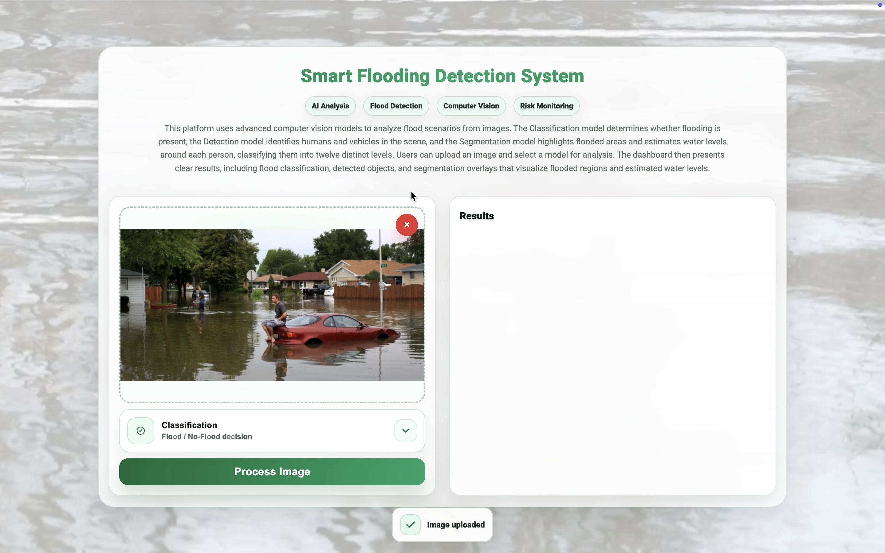
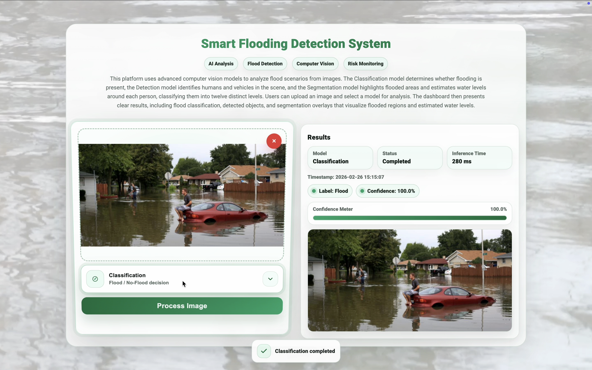
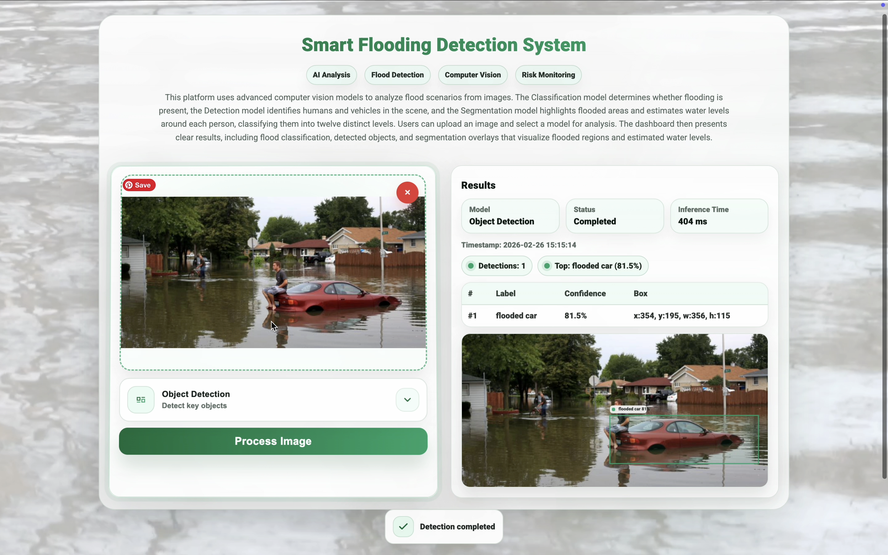
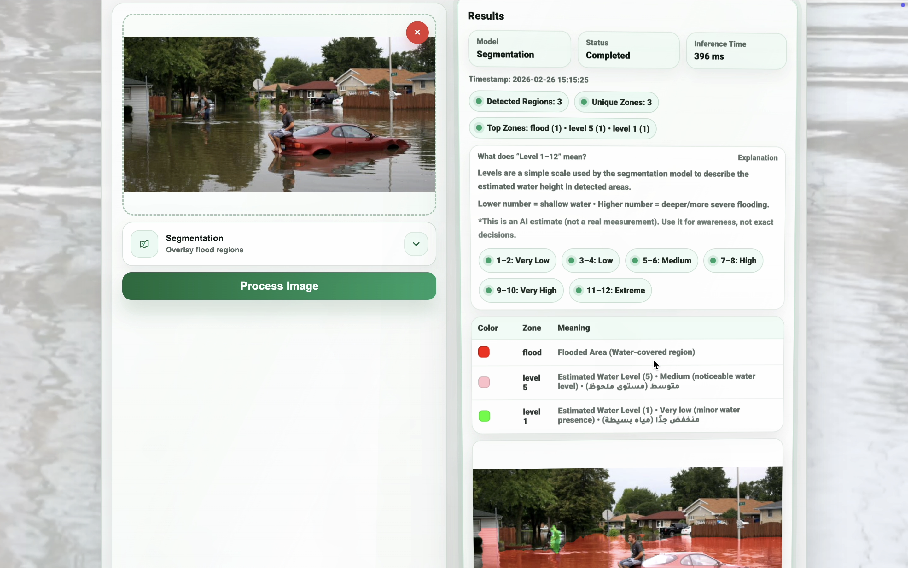

<p align="center">
  
</p>

<p align="center">
  
</p>
<p align="center">
  <b>AI-Powered Computer Vision Framework for Flood Scene Analysis and Safer Driving in Saudi Arabia</b>
</p>

<p align="center">
  
  
  
  
  
</p>

<p align="center">
  <sub>
    A computer vision framework for analyzing road flood environments using deep learning models and an interactive visualization dashboard.
  </sub>
  <br/>
  <sub>
    Model weights and the system demonstration video are available through GitHub Releases.
  </sub>
</p>

<p align="center">
  
</p>


# 🔎 Table of Contents

<a href="#overview"></a> Overview  
<a href="#problem-statement"></a> Problem Statement  
<a href="#key-features"></a> Key Features  
<a href="#ai-system-architecture"></a> AI System Architecture  
<a href="#ai-models"></a> AI Models  
<a href="#datasets"></a> Datasets  
<a href="#experimental-setup"></a> Experimental Setup  
<a href="#results"></a> Results  
<a href="#system-interface"></a> System Interface  
<a href="#system-screenshots"></a> Example Output  
<a href="#system-demonstration"></a> System Demonstration  
<a href="#repository-structure"></a> Repository Structure  
<a href="#installation"></a> Installation  
<a href="#future-work"></a> Future Work  


<p align="center">  </p>

<a id="overview"></a>
#  Overview

Flooded roads represent one of the most dangerous environmental hazards affecting transportation systems and urban mobility. Drivers often underestimate flood severity, which can lead to vehicle damage, accidents, and life-threatening situations.

This project introduces an **AI-powered flood scene analysis system** that leverages modern **computer vision and deep learning techniques** to automatically interpret flood environments from images.

The system combines multiple AI models to provide **comprehensive environmental analysis**, including:
- Flood presence detection
- Object detection in flooded environments
- Flooded region segmentation
- Water-level severity estimation

The system presents results through an **interactive web dashboard**, enabling intuitive interpretation of flood risk conditions.

This project demonstrates how **artificial intelligence can support environmental awareness and road safety in Saudi Arabia.**

<p align="center">  </p>


<a id="problem-statement"></a>
#  Problem Statement

Flood monitoring systems traditionally rely on physical sensors, weather reports, or manual observation. However, these approaches often lack **real-time visual understanding of road conditions**.

Drivers may encounter flooded roads without reliable information about:
- Flood depth
- Affected vehicles
- Severity of water accumulation

This project proposes a **computer vision based flood interpretation system** capable of analyzing road scenes and providing **visual risk assessment** from images.

<p align="center">  </p>


<a id="key-features"></a>
#  Key Features

✔ Multi-Model Computer Vision Pipeline  
✔ Flood Classification using Deep Learning  
✔ Object Detection for Vehicles and Humans  
✔ Flood Area Segmentation  
✔ Water Level Severity Estimation  
✔ Interactive AI Dashboard  
✔ Real-Time Image Analysis  
✔ Research-Level Experimental Evaluation  

<p align="center">  </p>


<a id="ai-system-architecture"></a>
#  AI System Architecture

The system follows a **multi-stage AI pipeline** designed to interpret flood environments using complementary computer vision models.


Each model contributes a different layer of environmental understanding.

| AI Module | Function |
|------|------|
| Classification | Determine flood presence |
| Object Detection | Detect vehicles and humans |
| Segmentation | Identify flooded areas |
| Interpretation Layer | Estimate flood severity |

Together they provide a **holistic AI interpretation of flood scenes**.

<p align="center">  </p>

<a id="ai-models"></a>
#  AI Models

The system integrates multiple deep learning architectures.

| Task | Model | Purpose |
|------|------|------|
| Flood Classification | EfficientNet | Detect flooded environments |
| Object Detection | YOLOv5 | Identify vehicles and humans |
| Flood Segmentation | YOLOv8 | Detect flooded regions |

<p align="center">  </p>


<a id="datasets"></a>
#  Datasets

The system was trained using multiple publicly available datasets that support classification, detection, segmentation, and water level estimation.

Full dataset documentation is available in: <div align="center">
  <a href="DATASETS.md">
    
  </a>
</div>

<p align="center">  </p>

<a id="experimental-setup"></a>
# Experimental Setup

Training environment:
- Python 3.9
- PyTorch
- Google Colab GPU (NVIDIA T4)

Evaluation metrics:
- Accuracy
- Precision
- Recall
- F1 Score
- mAP@0.5
- IoU

<p align="center">  </p>

<a id="results"></a>
#  Results

The proposed system achieved strong performance across multiple computer vision tasks.

## Flood Classification
EfficientNet achieved approximately:
- Accuracy ≈ 98%

## Object Detection Performance

| Model | Precision | Recall | mAP |
|------|------|------|------|
| YOLOv5 | 0.73 | 0.77 | 0.76 |
| YOLOv8 | **0.88** | **0.84** | **0.92** |

## Flood Segmentation
YOLOv8 segmentation models successfully detected flood regions with high pixel-level accuracy. The segmentation outputs enable visual estimation of **flood severity and water coverage**.

<p align="center">  </p>

<a id="system-interface"></a>
#  System Interface

The project includes an **interactive AI dashboard** built using Flask.

Users can:
- Upload flood scene images
- Select AI analysis models
- Visualize detection results
- Inspect segmentation overlays
- View estimated flood severity levels

The interface provides **clear visualization of AI predictions and environmental insights**.

<p align="center">  </p>

<a id="system-screenshots"></a>
# Example Output
Below are real screenshots from the dashboard, showcasing the full AI workflow across the three core tasks.


<p align="center">
  
</p>
<p align="center">
  
</p>

<p align="center">
  
</p>
<p align="center">
  
</p>

<p align="center">
  
</p>
<p align="center">
  
</p>

<p align="center">
  
</p>
<p align="center">
  
</p>


<a id="system-demonstration"></a>
# System Demonstration

A full demonstration of the system is available in the **Releases** section.

<div align="center">
  <a href="https://github.com/WASAN-ALMUTAAN1/Emergency-Smart-Flood-Alerting-System/releases">
    
  </a>
</div>
<p align="center">  </p>

<a id="repository-structure"></a>
#  Repository Structure

```text
Emergency-Smart-Flood-Alerting-System
├── README.md
├── smart-flooding-system
│   ├── app.py
│   ├── requirements.txt
│   ├── templates/
│   └── static/
├── Program
│   └── CPCS432_Program.ipynb
├── docs
│   ├── Emergency_Smart_Flood_Alerting_System.pdf
│   ├── Emergency_Smart_Flood_Alerting_System_Report.pdf
│   └── DATASETS.md
└── assets/
```

<p align="center">  </p>

<a id="installation"></a>
# ⚙ Installation

Clone the repository:
```bash
git clone https://github.com/WASAN-ALMUTAAN1/Emergency-Smart-Flood-Alerting-System
cd Emergency-Smart-Flood-Alerting-System
```

Install dependencies:
```bash
pip install -r smart-flooding-system/requirements.txt
```

Download the trained models from **Releases** and place them in the paths expected by `app.py`.

Run the application:
```bash
python smart-flooding-system/app.py
```

<p align="center">  </p>

<a id="future-work"></a>
#  Future Work

Future improvements may include:
- Integration with real-time traffic cameras
- Temporal flood analysis using video streams
- Integration with IoT flood sensors
- Smart city monitoring integration
- Deployment for autonomous hazard detection systems

<p align="center">
  
</p>


