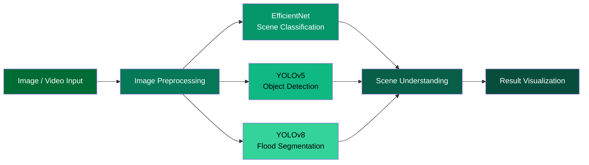
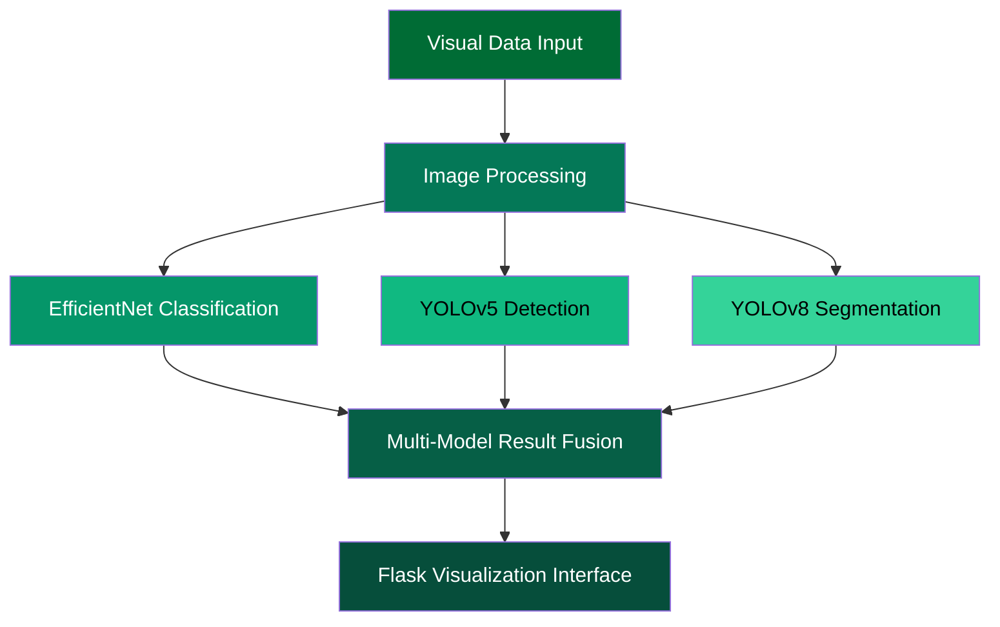
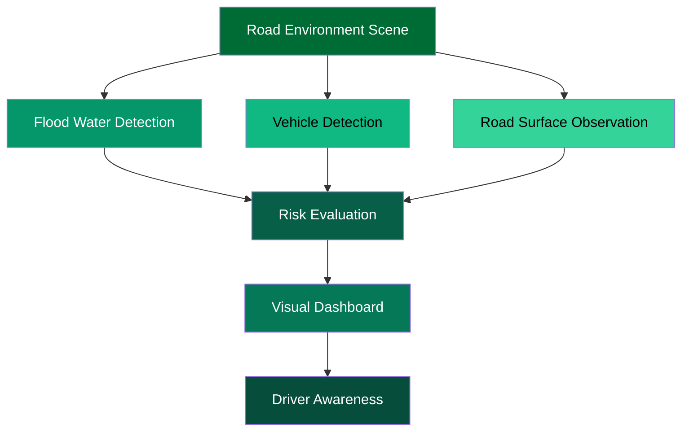

<p align="center">

</p>

<h1 align="center">
Emergency Smart Flood Alerting System for Safer Driving in Saudi Arabia
</h1>

<p align="center">
Artificial Intelligence System for Flood Scene Analysis Using Computer Vision
</p>

<p align="center">


</p>

---


# 🌊 Project Overview

Flooding represents one of the most dangerous environmental hazards affecting road safety.  
Flooded roads can lead to severe traffic incidents, infrastructure disruption, and driver risk.

This project introduces an **Artificial Intelligence system for flood scene analysis** using **computer vision techniques**.

The system integrates **deep learning models** with a **Flask-based web interface** to analyze flood imagery and visualize results.

The goal of the system is to demonstrate how **AI vision pipelines can interpret flood environments** and present visual insights through an interactive interface.

---

# 🧠 AI Vision Pipeline



The pipeline combines **classification, detection, and segmentation models** to interpret flood scenes at multiple levels.

---

# 🧩 AI System Architecture



This architecture illustrates how **multiple AI models cooperate in a unified visual analysis pipeline**.

---

# 🗺 Flood Scene Interpretation Map



This conceptual map demonstrates how **computer vision techniques analyze road environments during flood events**.

---

# 📊 AI Model Components

| Model | Purpose |
|------|------|
| EfficientNet | Flood scene classification |
| YOLOv5 | Object detection |
| YOLOv8 | Flood segmentation |

The system integrates these models to achieve **multi-level scene interpretation**.

---

# 📊 System Components

| Component | Description |
|------|------|
| Deep Learning Models | AI models used for scene analysis |
| Processing Pipeline | Image preprocessing and inference |
| Web Interface | Flask visualization dashboard |
| Documentation | Project methodology and references |

---

# 🖥 Web Application

The project includes a **Flask-based web interface** designed to visualize AI results.

The interface demonstrates:

• image input analysis  
• AI model inference  
• result visualization  

This interface shows how **AI vision models can be integrated into an interactive application environment**.

---

# 🧠 AI Processing Concept


This simplified diagram summarizes the **flow of information inside the AI system**.

---

# 🗂 Repository Structure

```
Emergency-Smart-Flood-Alerting-System
│
├── smart-flooding-system
│   ├── app.py
│   ├── requirements.txt
│   ├── templates
│   ├── static
│   └── models
│
├── Program
│   ├── CPCS432_Program.ipynb
│   └── Models
│
├── docs
│   ├── DatasetsLinks.txt
│   ├── Emergency_Smart_Flood_Alerting_System.pdf
│   └── Emergency Smart Flood Alerting System Report
│
└── assets
    └── project demonstration video
```

---

# ⚙ Installation

Clone the repository

```
git clone https://github.com/yourusername/Emergency-Smart-Flood-Alerting-System
cd Emergency-Smart-Flood-Alerting-System
```

Install dependencies

```
pip install -r smart-flooding-system/requirements.txt
```

Run the application

```
python smart-flooding-system/app.py
```

---

# 📦 Model Weights

Model weights are provided through **GitHub Releases** to keep the repository lightweight.

After downloading the weights place them in:

```
smart-flooding-system/models
```

---

# 📚 Documentation

Project documentation is available in the **docs directory**.

```
docs/Emergency_Smart_Flood_Alerting_System.pdf
```

Dataset references are listed in:

```
docs/DatasetsLinks.txt
```

---


